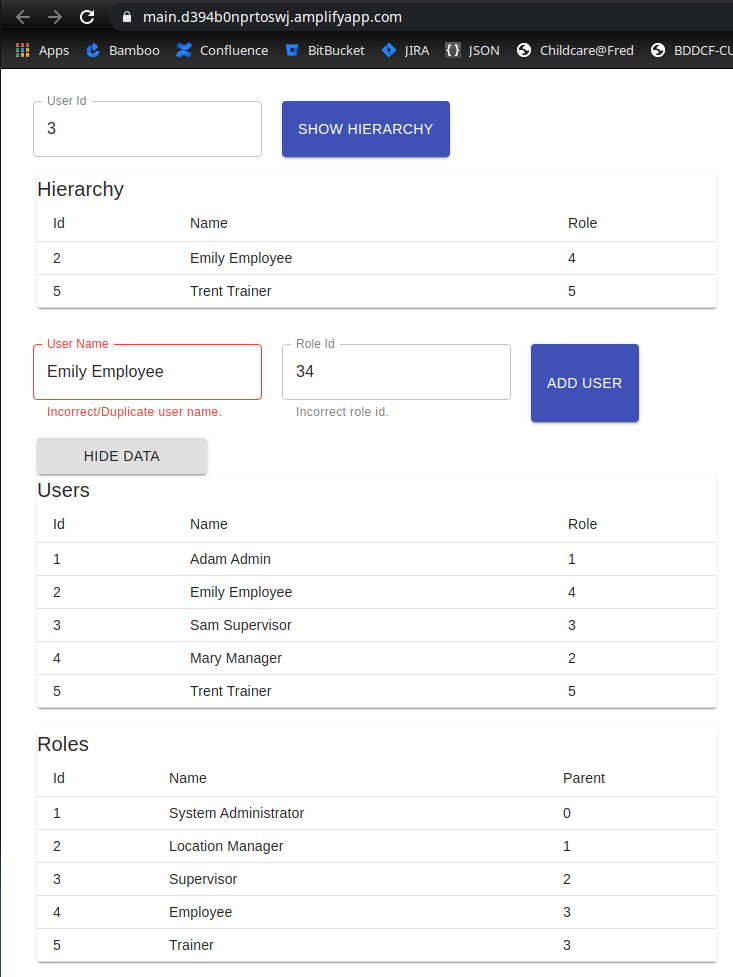

# Getting Started with Coding Challenge - Users Hierarchy

### `git clone https://github.com/ferhat-hajdarpasic/oohmedia.git`

### `npm install`
To download all dependencies
### `npm start`

Runs the app in the development mode.\
Open [http://localhost:3000](http://localhost:3000) to view it in the browser.
### `npm test`
Launches the test runner in the interactive watch mode.\
See the section about [running tests](https://facebook.github.io/create-react-app/docs/running-tests) for more information.

### `Screenshot`


### `AWS Screenshot`



### Query for average salary of “Content Creating Lead”
`SELECT avg(salary) FROM employees where roleid = 2;`

### Query for hierarchy for a person with role name E.g. for id 1
```
select r.name, e.name from employees e
	join roles r on r.id = e.roleid 
	where roleid in (
		WITH RECURSIVE subroles AS (
	    select roles.id, roles.parentId, roles.name
	    	from roles where parentId = 1
	    UNION ALL
	    	select roles.id, roles.parentId, roles.name
	    from subroles
	        JOIN roles ON roles.parentId = subroles.id)
		select distinct(subroles.id) from subroles
		)
	order by r.name;
```
